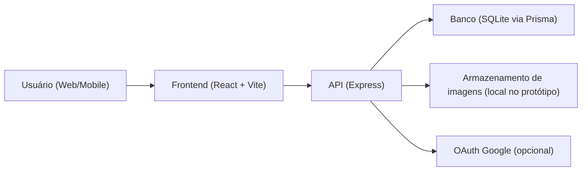
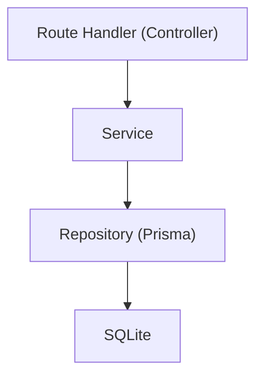
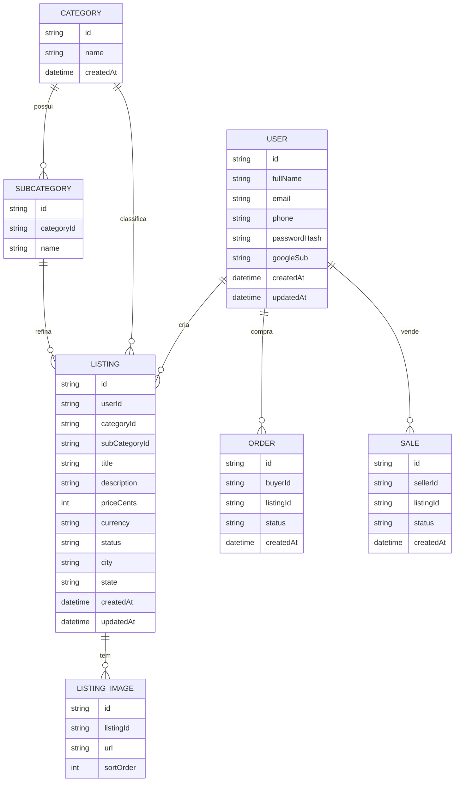

## 1. Desenho de Arquitetura

## 2. Tecnologias
- Frontend: React + Vite + TypeScript
- UI: Tailwind CSS (design system próprio)
- Auth: credenciais (e-mail/senha com hash) + Google OAuth
- Backend: Express + TypeScript (ESM)
- Banco: SQLite (via Prisma) para protótipo e migração fácil para Postgres
- Upload de imagens: armazenamento local no protótipo (pasta pública) com plano para S3 compatível

## 3. Rotas
| Rota | Finalidade |
|------|------------|
| / | Home + busca + filtros |
| /auth | Cadastro/Login |
| /anunciar | Criar anúncio |
| /anuncio/[id] | Detalhe do anúncio |
| /perfil | Perfil do usuário |

## 4. APIs (contratos)
### 4.1 Autenticação
- `POST /api/auth/register`
  - Req: `{ fullName, email, password, phone }`
  - Res: `{ user }` (ou erro validado)
- `POST /api/auth/login`
  - Req: `{ email, password }`
  - Res: `{ user }` + cookie de sessão
- `POST /api/auth/logout`
  - Res: `{ ok: true }`
- `GET /api/auth/me`
  - Res: `{ user | null }`

### 4.2 Produtos/Anúncios
- `GET /api/listings?query&categoryId&subCategoryId&page`
- `GET /api/listings/[id]`
- `POST /api/listings`
- `PATCH /api/listings/[id]`
- `DELETE /api/listings/[id]`

### 4.3 Perfil
- `PATCH /api/profile`
- `GET /api/profile/listings`
- `GET /api/profile/orders` (compras)
- `GET /api/profile/sales` (vendas)

## 5. Diagrama de Servidor (camadas)

## 6. Modelo de Dados
### 6.1 ERD

### 6.2 DDL (alto nível)
- Índices: `User.email` único; `Listing.categoryId`, `Listing.subCategoryId`, `Listing.createdAt`
- Migrações via Prisma para evoluir categorias/subcategorias sem reestruturação
