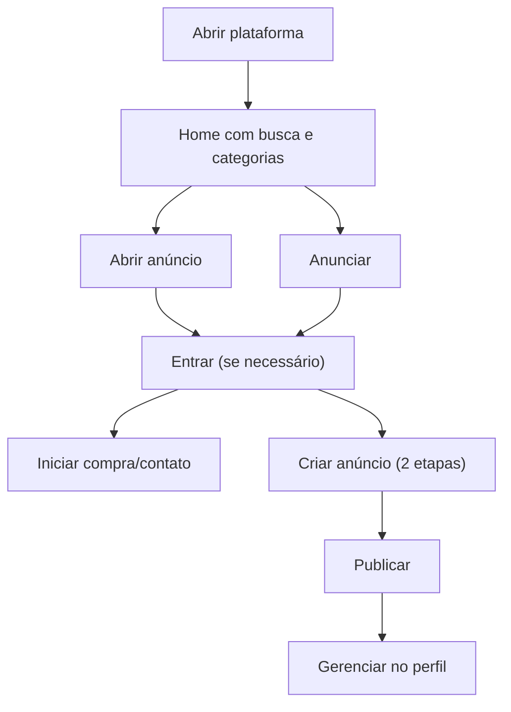

## 1. Visão Geral do Produto
Lugar de desapegar é um marketplace simples para vender e comprar produtos usados com poucos cliques, com foco em acessibilidade, velocidade e fluxo de anúncio descomplicado.
- Resolve: fricção para anunciar e encontrar itens usados com segurança e rapidez
- Público: pessoas leigas, mobile-first, vendedores ocasionais e compradores de oportunidade

## 2. Funcionalidades Principais

### 2.1 Papéis de Usuário
| Papel | Método de cadastro | Permissões principais |
|------|---------------------|-----------------------|
| Usuário | E-mail + senha / Google | Criar anúncios, comprar, vender, editar perfil, gerenciar privacidade |

### 2.2 Módulos Essenciais
1. **Autenticação**: cadastro/login unificados, validação de campos, recuperação de sessão, logout
2. **Exploração**: listagem com busca e filtros por categoria/subcategoria
3. **Detalhe do anúncio**: fotos, descrição, preço, vendedor, CTA de contato/compra
4. **Publicar anúncio**: fluxo curto para criar/editar anúncio com upload de imagens
5. **Perfil**: dados cadastrais, anúncios, compras/vendas, privacidade

### 2.3 Detalhamento de Páginas
| Página | Módulo | Descrição |
|------|--------|-----------|
| /auth | Cadastro/Login | Formulário unificado (nome, e-mail, senha, telefone) + login Google; mensagens de erro claras |
| / | Home/Busca | Barra de busca, filtros, grid de anúncios, chips de categoria, carregamento incremental |
| /anuncio/[id] | Detalhe | Galeria de imagens, informações do item, perfil do vendedor, ações de compra/contato |
| /anunciar | Criar anúncio | Wizard em 2 etapas: (1) categoria + detalhes (2) fotos + revisão |
| /perfil | Perfil | Editar dados, anúncios do usuário, compras e vendas, privacidade |

## 3. Processo Principal
- Usuário entra → faz login/cadastro → navega por categorias → abre anúncio → inicia compra/contato
- Usuário vendedor entra → cria anúncio em 2 etapas → publica → acompanha interesse/negociação

## 4. Design de Interface
### 4.1 Estilo
- Direção: “editorial urbano” (alto contraste, cartões densos, micro-interações leves)
- Cores: base escura (azul petróleo) + acentos (limão/menta) + estados (âmbar/vermelho)
- Tipografia: display geométrica para títulos + texto muito legível para conteúdos e formulários
- Componentes: cartões com bordas suaves, sombras controladas, foco visível, inputs grandes

### 4.2 Visão por Página
| Página | Módulo | Elementos |
|------|--------|-----------|
| / | Busca | cabeçalho fixo, busca com sugestões, chips de categoria, filtros, grid responsivo |
| /auth | Acesso | layout de uma coluna no mobile, duas no desktop; alternância login/cadastro sem navegação extra |
| /anunciar | Fluxo | passos com progresso, validação inline, upload com preview e reordenação |
| /perfil | Conta | abas (dados, anúncios, compras/vendas, privacidade), tabelas mobile-friendly |

### 4.3 Responsividade e Acessibilidade
- Mobile-first com layout que escala para desktop sem perder hierarquia
- Alvos de toque ≥ 44px, contraste AA/AAA onde aplicável
- Navegação por teclado completa, foco visível e labels/aria consistentes
- Feedback imediato: estados de loading, empty state e erros com linguagem simples
